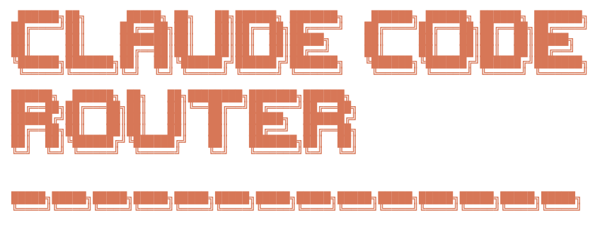
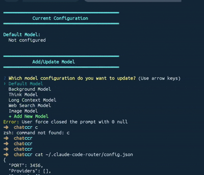

[](https://github.com/musistudio/claude-code-router/blob/main/LICENSE)

## ✨ Features

- **Model Routing**: Route requests to different models based on your needs (e.g., background tasks, thinking, long context).
- **Multi-Provider Support**: Supports various model providers like OpenRouter, DeepSeek, Ollama, Gemini, Volcengine, and SiliconFlow.
- **Request/Response Transformation**: Customize requests and responses for different providers using transformers.
- **Dynamic Model Switching**: Switch models on-the-fly within Claude Code using the `/model` command.
- **CLI Model Management**: Manage models and providers directly from the terminal with `ccr model`.
- **GitHub Actions Integration**: Trigger Claude Code tasks in your GitHub workflows.
- **Plugin System**: Extend functionality with custom transformers.

## 🛠 Improvements in this fork

This fork is based on [claude-code-router](https://github.com/musistudio/claude-code-router) and includes several enhancements:

- **Improved LLM Support**: Fixed streaming for Gemini/Gemma and enhanced OpenAI API handling.
- **Reasoning & Streaming Refactor**: Modularized streaming and reasoning logic into reusable utilities for better maintainability.
- **Mistral Integration**: Added specific handling for Mistral's reasoning parameters and decoupled transformation logic.
- **Build & Deployment**: Integrated the UI package into the Docker build process and added a Docker Compose configuration.
- **Code Quality**: Localized codebase (English comments), improved error handling, and addressed Copilot review feedback.
- **Gemini Stability & Tool Use Fixes**: Corrected `thoughtSignature` placement in Gemini request bodies (must be a standalone `thought: true` part, not attached to text/function-call parts); filtered synthetic `ccr_` placeholder signatures from outgoing Gemini requests to prevent Gemini 500 errors; fixed `tool_result` content-array serialization in the Anthropic transformer so models receive plain text instead of JSON-wrapped arrays (resolves "Error editing file" in Claude Code); fixed Fastify `onSend` hook to prevent `invalid type 'object'` unhandled rejections on error responses.
- **Codex (ChatGPT) Integration**: Added Codex transformer for the ChatGPT backend API (Responses API), supporting OAuth-based authentication (`ccr codex-auth`), SSE streaming, reasoning/thinking content, tool calls with web search, and image handling.
- **DeepSeek Reasoning Replay**: Implemented mandatory reasoning replay for DeepSeek models (e.g., via OpenCode/ZenGo). DeepSeek requires previous assistant reasoning content to be included in subsequent requests — the `reasoning` transformer automatically replays reasoning output from prior turns.
- **Model Discovery**: Enabled non-interactive model discovery for arbitrary API providers. Using `ccr model get <provider>`, the tool automatically fetches remote models, parses custom JSON structures using configurable paths, and appends missing models to the local configuration while preserving existing settings.
- **Chrome On-Device Model**: Added `chrome-on-device` transformer for Chrome's built-in Gemini Nano (~4GB local model). Communicates via a bridge process (`ccr chrome-bridge`) that connects to Chrome's Prompt API over CDP. Uses `responseConstraint` for structured JSON output (tool calls + text), supports streaming and non-streaming, exposes an OpenAI-compatible `/v1/chat/completions` endpoint, and replaces Claude Code's system prompt with a minimal tool-focused one. Zero API cost, zero latency to external providers.
  - **Stability & Prompting**: Implemented an "OPERATIONAL OVERRIDE" in the system prompt to prevent hallucinations and force adherence to user-provided paths.
  - **Stall Recovery**: Added a tiered retry mechanism for whitespace-heavy content: if the model stalls (emits 1000+ whitespace chars), the bridge aborts and retries without constraints and with increased temperature (Dynamic Temperature Scaling).
  - **Contextual awareness**: Added labels ("Tool Result:") to tool outputs and instructed the model to check for existing results before calling tools again.

## 🚀 Getting Started

### 1. Installation

#### Prerequisites

Before you begin, ensure you have the following installed on your system:
- **Docker & Docker Compose** (Recommended): The primary way to run the router. See [Docker Install Guide](https://docs.docker.com/get-docker/).
- **Node.js** (Optional): Only required if you want to use the **Chrome On-Device** bridge or run the project from source. Requires v18.0.0 or higher. See [Node.js Download](https://nodejs.org/).
- **Claude Code**: See the [official quickstart guide](https://code.claude.com/docs/en/quickstart) for installation instructions.

#### Quick Start with Docker

The fastest way to launch Claude Code Router is using Docker Compose:

```shell
cd packages/server
docker compose up --build -d
```

The Compose setup builds the server and UI into the `ccr` container, exposes the proxy on `http://localhost:3456`, and mounts configuration from `packages/server/ccr-config` to `/root/.claude-code-router` inside the container.

### 2. Configuration

Create and configure your `~/.claude-code-router/config.json` file. For more details, you can refer to `config.example.json`.

The `config.json` file has several key sections:

- **`PROXY_URL`** (optional): You can set a proxy for API requests, for example: `"PROXY_URL": "http://127.0.0.1:7890"`.
- **`LOG`** (optional): You can enable logging by setting it to `true`. When set to `false`, no log files will be created. Default is `true`.
- **`LOG_LEVEL`** (optional): Set the logging level. Available options are: `"fatal"`, `"error"`, `"warn"`, `"info"`, `"debug"`, `"trace"`. Default is `"debug"`.
- **Logging Systems**: The Claude Code Router uses two separate logging systems:
  - **Server-level logs**: HTTP requests, API calls, and server events are logged using pino in the `~/.claude-code-router/logs/` directory with filenames like `ccr-*.log`
  - **Application-level logs**: Routing decisions and business logic events are logged in `~/.claude-code-router/claude-code-router.log`
- **`APIKEY`** (optional): You can set a secret key to authenticate requests. When set, clients must provide this key in the `Authorization` header (e.g., `Bearer your-secret-key`) or the `x-api-key` header. Example: `"APIKEY": "your-secret-key"`.
- **`HOST`** (optional): You can set the host address for the server. If `APIKEY` is not set, the host will be forced to `127.0.0.1` for security reasons to prevent unauthorized access. Example: `"HOST": "0.0.0.0"`.
- **`NON_INTERACTIVE_MODE`** (optional): When set to `true`, enables compatibility with non-interactive environments like GitHub Actions, Docker containers, or other CI/CD systems. This sets appropriate environment variables (`CI=true`, `FORCE_COLOR=0`, etc.) and configures stdin handling to prevent the process from hanging in automated environments. Example: `"NON_INTERACTIVE_MODE": true`.

- **`Providers`**: Used to configure different model providers.
- **`Router`**: Used to set up routing rules. `default` specifies the default model, which will be used for all requests if no other route is configured.
- **`API_TIMEOUT_MS`**: Specifies the timeout for API calls in milliseconds.

#### Environment Variable Interpolation

Claude Code Router supports environment variable interpolation for secure API key management. You can reference environment variables in your `config.json` using either `$VAR_NAME` or `${VAR_NAME}` syntax:

```json
{
  "OPENAI_API_KEY": "$OPENAI_API_KEY",
  "GEMINI_API_KEY": "${GEMINI_API_KEY}",
  "Providers": [
    {
      "name": "openai",
      "api_base_url": "https://api.openai.com/v1/chat/completions",
      "api_key": "$OPENAI_API_KEY",
      "models": ["gpt-5", "gpt-5-mini"]
    }
  ]
}
```

This allows you to keep sensitive API keys in environment variables instead of hardcoding them in configuration files. The interpolation works recursively through nested objects and arrays.

Here is a comprehensive example:

```json
{
  "APIKEY": "your-secret-key",
  "PROXY_URL": "http://127.0.0.1:7890",
  "LOG": true,
  "API_TIMEOUT_MS": 600000,
  "NON_INTERACTIVE_MODE": false,
  "Providers": [
    {
      "name": "openrouter",
      "api_base_url": "https://openrouter.ai/api/v1/chat/completions",
      "api_key": "sk-xxx",
      "models": [
        "google/gemini-2.5-pro-preview",
        "anthropic/claude-sonnet-4",
        "anthropic/claude-3.5-sonnet",
        "anthropic/claude-3.7-sonnet:thinking"
      ],
      "transformer": {
        "use": ["openrouter"]
      }
    },
    {
      "name": "deepseek",
      "api_base_url": "https://api.deepseek.com/chat/completions",
      "api_key": "sk-xxx",
      "models": ["deepseek-chat", "deepseek-reasoner"],
      "transformer": {
        "use": ["deepseek"],
        "deepseek-chat": {
          "use": ["tooluse"]
        }
      }
    },
    {
      "name": "ollama",
      "api_base_url": "http://localhost:11434/v1/chat/completions",
      "api_key": "ollama",
      "models": ["qwen2.5-coder:latest"]
    },
    {
      "name": "gemini",
      "api_base_url": "https://generativelanguage.googleapis.com/v1beta/models/",
      "api_key": "sk-xxx",
      "models": ["gemini-2.5-flash", "gemini-2.5-pro", "gemma-4-31b-it"],
      "transformer": {
        "use": ["gemini"]
      }
    },
    {
      "name": "volcengine",
      "api_base_url": "https://ark.cn-beijing.volces.com/api/v3/chat/completions",
      "api_key": "sk-xxx",
      "models": ["deepseek-v3-250324", "deepseek-r1-250528"],
      "transformer": {
        "use": ["deepseek"]
      }
    },
    {
      "name": "modelscope",
      "api_base_url": "https://api-inference.modelscope.cn/v1/chat/completions",
      "api_key": "",
      "models": ["Qwen/Qwen3-Coder-480B-A35B-Instruct", "Qwen/Qwen3-235B-A22B-Thinking-2507"],
      "transformer": {
        "use": [
          [
            "maxtoken",
            {
              "max_tokens": 65536
            }
          ],
          "enhancetool"
        ],
        "Qwen/Qwen3-235B-A22B-Thinking-2507": {
          "use": ["reasoning"]
        }
      }
    },
    {
      "name": "dashscope",
      "api_base_url": "https://dashscope.aliyuncs.com/compatible-mode/v1/chat/completions",
      "api_key": "",
      "models": ["qwen3-coder-plus"],
      "transformer": {
        "use": [
          [
            "maxtoken",
            {
              "max_tokens": 65536
            }
          ],
          "enhancetool"
        ]
      }
    },
    {
      "name": "aihubmix",
      "api_base_url": "https://aihubmix.com/v1/chat/completions",
      "api_key": "sk-",
      "models": [
        "glm-4.5",
        "claude-opus-4-20250514",
        "gemini-2.5-pro"
      ]
    }
  ],
  "Router": {
    "default": "deepseek,deepseek-chat",
    "background": "ollama,qwen2.5-coder:latest",
    "think": "deepseek,deepseek-reasoner",
    "longContext": "openrouter,google/gemini-2.5-pro-preview",
    "longContextThreshold": 60000,
    "webSearch": "gemini,gemini-2.5-flash"
  }
}
```

#### Adding a New Provider

If you want to add a new provider and automatically discover its models, follow these steps:

1. **Add Minimal Config**: Add a new entry to the `Providers` array in `config.json` with just the basic details:
   ```json
   {
     "name": "my-new-provider",
     "api_base_url": "https://api.example.com/v1/chat/completions",
     "api_key": "$MY_API_KEY",
     "models": []
   }
   ```
2. **Perform Model Discovery**: Run the discovery command to fetch available models:
   ```shell
   ccr model get my-new-provider
   ```
3. **Sync Models**: The command will list remote models and prompt you to append missing ones to your configuration.
4. **Restart**: Restart the service to pick up the updated configuration:
   ```shell
   ccr restart
   ```

> **Tip**: For a more comprehensive description of model discovery options, custom JSON response formats, and interactive model management, see the [CLI Model Management](#5-cli-model-management) section.

### 3. Running Claude Code with the Router

#### Via `ccr code`

Start Claude Code using the router:

```shell
ccr code
```

#### Via Claude Code Settings (Alternative)

You can also configure Claude Code to always use the router by editing its `settings.json` file (typically at `~/.claude/settings.json`). Models are specified using the `<provider>,<model>` syntax:

```json
{
  "env": {
    "ANTHROPIC_BASE_URL": "http://127.0.0.1:3456",
    "ANTHROPIC_AUTH_TOKEN": "dummy",
    "ANTHROPIC_DEFAULT_HAIKU_MODEL": "gemini,gemma-4-31b-it",
    "ANTHROPIC_DEFAULT_SONNET_MODEL": "opencode,minimax-m2.7",
    "ANTHROPIC_DEFAULT_OPUS_MODEL": "opencode,glm-5.1"
  }
}
```

| Variable | Purpose |
|---|---|
| `ANTHROPIC_BASE_URL` | Points Claude Code to the router's proxy address |
| `ANTHROPIC_AUTH_TOKEN` | Must match the `APIKEY` value set in the router's `config.json` |
| `ANTHROPIC_MODEL` | Default model (overrides per-tier defaults below) |
| `ANTHROPIC_DEFAULT_HAIKU_MODEL` | Fast / cost-effective model (Haiku equivalent) |
| `ANTHROPIC_DEFAULT_SONNET_MODEL` | Balanced performance model (Sonnet equivalent) |
| `ANTHROPIC_DEFAULT_OPUS_MODEL` | Maximum capability model (Opus equivalent) |

This approach lets you run `claude` directly without needing `ccr code`.

> **Note**: After modifying the configuration file, you need to restart the service for the changes to take effect:
>
> ```shell
> ccr restart
> ```

### 4. UI Mode

For a more intuitive experience, you can use the UI mode to manage your configuration:

```shell
ccr ui
```

This will open a web-based interface where you can easily view and edit your `config.json` file.


### 5. CLI Model Management

For users who prefer terminal-based workflows, you can use the interactive CLI model selector:

```shell
ccr model
```


This command provides an interactive interface to:

- View current configuration:
- See all configured models (default, background, think, longContext, webSearch, image)
- Switch models: Quickly change which model is used for each router type
- Add new models: Add models to existing providers
- Create new providers: Set up complete provider configurations including:
   - Provider name and API endpoint
   - API key
   - Available models
   - Transformer configuration with support for:
     - Multiple transformers (openrouter, deepseek, gemini, etc.)
     - Transformer options (e.g., maxtoken with custom limits)
     - Provider-specific routing (e.g., OpenRouter provider preferences)

The CLI tool validates all inputs and provides helpful prompts to guide you through the configuration process, making it easy to manage complex setups without editing JSON files manually.

For non-interactive model discovery, you can also test provider access and list remote models directly:

```shell
ccr model get openai
ccr model get gemini
```

This command:
- Calls the provider's model-list endpoint using the configured API key
- Prints the remote models returned by the provider
- Prompts to append only missing models to the configured `models` array

Built-in endpoint support is included for `openai` and `gemini`. For other providers, you can configure `models_api_url` and a custom `models_response_format` to handle different JSON response structures.

The `models_response_format` object supports:
- `listPath`: JSON path to the array of models (e.g., `"data"`, `"models"`, or `""` for root array)
- `idPath`: Field name within each model object to use as ID (e.g., `"id"`, `"name"`, `"slug"`)
- `stripPrefix`: Optional prefix to remove from model IDs (e.g., `"models/"`)

Example:

```json
{
  "name": "together.ai",
  "api_base_url": "https://api.together.ai/v1/chat/completions",
  "models_api_url": "https://api.together.ai/v1/models",
  "api_key": "$TOGETHERAI_API_KEY",
  "models": [],
  "models_response_format": {
    "listPath": "",
    "idPath": "id"
  }
}
```

You can also override these settings via CLI flags for testing:
```shell
ccr model get my-provider --list-path data --id-path id --strip-prefix "v1/"
```

If the provider returns additional models, `ccr model get <provider>` can append only the missing entries while keeping existing configured models unchanged.

> **Note**: After syncing models into `config.json`, restart the service with `ccr restart` so the updated provider list is picked up by the running server.

#### Codex Provider Authentication

The Codex provider uses OAuth to authenticate with the ChatGPT backend. Before using Codex models, you must authenticate with your OpenAI account:

```shell
ccr codex-auth
```

This command:
1. Opens your browser to the OpenAI OAuth authorization page
2. After you sign in, the OAuth callback is handled by the running CCR server
3. Tokens are stored in `~/.claude-code-router/codex_auth.json`
4. The Codex transformer automatically refreshes tokens when they expire

> **Note**: The server must be running for `ccr codex-auth` to work, as it hosts the OAuth callback endpoint.

**Running with Docker**:

The OAuth callback uses port `1455`, which is mapped to the CCR server port in `docker-compose.yml` (`"1455:3456"`). When running in Docker:

```shell
docker exec -it claude-code-router ccr codex-auth
```

The CLI prints a URL to open in your host browser. After signing in, the browser redirects to `http://localhost:1455/auth/callback`, which Docker forwards to the container. Tokens persist across container restarts via the volume-mounted `./ccr-config` directory.

#### Chrome On-Device Bridge

The `chrome-on-device` transformer requires a bridge process running on the host to communicate with Chrome's Gemini Nano model:

```bash
# Start the bridge (default: port 3457, CDP port 9222)
ccr chrome-bridge

# Custom ports
ccr chrome-bridge --port 3457 --cdp 9222
```

The bridge:
1. Checks if Chrome is running with remote debugging enabled (port 9222)
2. If not, launches Chrome with the required flags (`--remote-debugging-port=9222 --user-data-dir=/tmp/chrome-debug-profile`)
3. Connects to Chrome via Puppeteer/CDP with a 5-minute protocol timeout to handle slow model inference
4. Loads a page that accesses the Prompt API (`window.LanguageModel`) and maintains a persistent `LanguageModel` session across all requests — conversation history is carried forward naturally within the session, not rebuilt per request
5. Replaces Claude Code's system prompt with a minimal tool-focused one (5 core tools), using `responseConstraint` (JSON Schema) to force the model to emit structured JSON with `{text, tool_calls[]}` fields
6. Exposes an OpenAI-compatible HTTP API on `0.0.0.0:3457`:
   - `GET /v1/models` — returns available models with live context usage
   - `GET /v1/models/{model_name}` — returns individual model info (display_name, max_input_tokens, capabilities)
   - `POST /v1/chat/completions` — chat completions with streaming and non-streaming support
   - `GET /health` — health check

**Prerequisites**: Chrome flags must be enabled (see Chrome On-Device Provider Configuration section). The model (~4GB) must be downloaded.

> **Note for Docker**: The bridge runs on the Docker **host**, not inside the container. Set the provider host to `http://host.docker.internal:3457` in your `config.json`.

### 6. Presets Management

Presets allow you to save, share, and reuse configurations easily. You can export your current configuration as a preset and install presets from files or URLs.

```shell
# Export current configuration as a preset
ccr preset export my-preset

# Export with metadata
ccr preset export my-preset --description "My OpenAI config" --author "Your Name" --tags "openai,production"

# Install a preset from local directory
ccr preset install /path/to/preset

# List all installed presets
ccr preset list

# Show preset information
ccr preset info my-preset

# Delete a preset
ccr preset delete my-preset
```

**Preset Features:**
- **Export**: Save your current configuration as a preset directory (with manifest.json)
- **Install**: Install presets from local directories
- **Sensitive Data Handling**: API keys and other sensitive data are automatically sanitized during export (marked as `{{field}}` placeholders)
- **Dynamic Configuration**: Presets can include input schemas for collecting required information during installation
- **Version Control**: Each preset includes version metadata for tracking updates

**Preset File Structure:**
```
~/.claude-code-router/presets/
├── my-preset/
│   └── manifest.json    # Contains configuration and metadata
```

### 7. Activate Command (Environment Variables Setup)

The `activate` command allows you to set up environment variables globally in your shell, enabling you to use the `claude` command directly or integrate Claude Code Router with applications built using the Agent SDK.

To activate the environment variables, run:

```shell
eval "$(ccr activate)"
```

This command outputs the necessary environment variables in shell-friendly format, which are then set in your current shell session. After activation, you can:

- **Use `claude` command directly**: Run `claude` commands without needing to use `ccr code`. The `claude` command will automatically route requests through Claude Code Router.
- **Integrate with Agent SDK applications**: Applications built with the Anthropic Agent SDK will automatically use the configured router and models.

The `activate` command sets the following environment variables:

- `ANTHROPIC_AUTH_TOKEN`: API key from your configuration
- `ANTHROPIC_BASE_URL`: The local router endpoint (default: `http://127.0.0.1:3456`)
- `NO_PROXY`: Set to `127.0.0.1` to prevent proxy interference
- `DISABLE_TELEMETRY`: Disables telemetry
- `DISABLE_COST_WARNINGS`: Disables cost warnings
- `API_TIMEOUT_MS`: API timeout from your configuration

> **Note**: Make sure the Claude Code Router service is running (`ccr start`) before using the activated environment variables. The environment variables are only valid for the current shell session. To make them persistent, you can add `eval "$(ccr activate)"` to your shell configuration file (e.g., `~/.zshrc` or `~/.bashrc`).

#### Providers

The `Providers` array is where you define the different model providers you want to use. Each provider object requires:

- `name`: A unique name for the provider.
- `api_base_url`: The full API endpoint for chat completions.
- `api_key`: Your API key for the provider.
- `models`: A list of model names available from this provider.
- `transformer` (optional): Specifies transformers to process requests and responses.

#### Transformers

Transformers allow you to modify the request and response payloads to ensure compatibility with different provider APIs.

- **Global Transformer**: Apply a transformer to all models from a provider. In this example, the `openrouter` transformer is applied to all models under the `openrouter` provider.
  ```json
  {
    "name": "openrouter",
    "api_base_url": "https://openrouter.ai/api/v1/chat/completions",
    "api_key": "sk-xxx",
    "models": [
      "google/gemini-2.5-pro-preview",
      "anthropic/claude-sonnet-4",
      "anthropic/claude-3.5-sonnet"
    ],
    "transformer": { "use": ["openrouter"] }
  }
  ```
- **Model-Specific Transformer**: Apply a transformer to a specific model. In this example, the `deepseek` transformer is applied to all models, and an additional `tooluse` transformer is applied only to the `deepseek-chat` model.

  ```json
  {
    "name": "deepseek",
    "api_base_url": "https://api.deepseek.com/chat/completions",
    "api_key": "sk-xxx",
    "models": ["deepseek-chat", "deepseek-reasoner"],
    "transformer": {
      "use": ["deepseek"],
      "deepseek-chat": { "use": ["tooluse"] }
    }
  }
  ```

- **Passing Options to a Transformer**: Some transformers, like `maxtoken`, accept options. To pass options, use a nested array where the first element is the transformer name and the second is an options object.
  ```json
  {
    "name": "siliconflow",
    "api_base_url": "https://api.siliconflow.cn/v1/chat/completions",
    "api_key": "sk-xxx",
    "models": ["moonshotai/Kimi-K2-Instruct"],
    "transformer": {
      "use": [
        [
          "maxtoken",
          {
            "max_tokens": 16384
          }
        ]
      ]
    }
  }
  ```

**Available Built-in Transformers:**

- `Anthropic`:If you use only the `Anthropic` transformer, it will preserve the original request and response parameters(you can use it to connect directly to an Anthropic endpoint).
- `deepseek`: Adapts requests/responses for DeepSeek API.
- `gemini`: Adapts requests/responses for Gemini API.
- `mistral`: Adapts requests/responses for Mistral API.
- `openrouter`: Adapts requests/responses for OpenRouter API. It can also accept a `provider` routing parameter to specify which underlying providers OpenRouter should use. For more details, refer to the [OpenRouter documentation](https://openrouter.ai/docs/features/provider-routing). See an example below:
  ```json
    "transformer": {
      "use": ["openrouter"],
      "moonshotai/kimi-k2": {
        "use": [
          [
            "openrouter",
            {
              "provider": {
                "only": ["moonshotai/fp8"]
              }
            }
          ]
        ]
      }
    }
  ```
- `groq`: Adapts requests/responses for groq API.
- `maxtoken`: Sets a specific `max_tokens` value.
- `tooluse`: Optimizes tool usage for certain models via `tool_choice`.
- `gemini-cli` (experimental): Unofficial support for Gemini via Gemini CLI [gemini-cli.js](https://gist.github.com/musistudio/1c13a65f35916a7ab690649d3df8d1cd).
- `reasoning`: Used to process the `reasoning_content` field.
- `sampling`: Used to process sampling information fields such as `temperature`, `top_p`, `top_k`, and `repetition_penalty`.
- `enhancetool`: Adds a layer of error tolerance to the tool call parameters returned by the LLM (this will cause the tool call information to no longer be streamed).
- `cleancache`: Clears the `cache_control` field from requests.
- `vertex-gemini`: Handles the Gemini API using Vertex authentication.
- `chutes-glm` Unofficial support for GLM 4.5 model via Chutes [chutes-glm-transformer.js](https://gist.github.com/vitobotta/2be3f33722e05e8d4f9d2b0138b8c863).
- `qwen-cli` (experimental): Unofficial support for qwen3-coder-plus model via Qwen CLI [qwen-cli.js](https://gist.github.com/musistudio/f5a67841ced39912fd99e42200d5ca8b).
- `rovo-cli` (experimental): Unofficial support for gpt-5 via Atlassian Rovo Dev CLI [rovo-cli.js](https://gist.github.com/SaseQ/c2a20a38b11276537ec5332d1f7a5e53).
- `codex`: Adapts requests/responses for the Codex (ChatGPT) Responses API. Requires OAuth authentication via `ccr codex-auth`.
- `chrome-on-device`: Routes requests to Chrome's on-device Gemini Nano model via the Prompt API. Uses `responseConstraint` for structured JSON output. Requires a bridge process running on the host (`ccr chrome-bridge`).

**Chrome On-Device Provider Configuration:**

The `chrome-on-device` transformer routes requests to Chrome's built-in Gemini Nano model. This is a ~4GB on-device model that runs locally with no API costs. The model is accessed through Chrome's Prompt API (`window.LanguageModel`) via a bridge process.

**Prerequisites:**

1. Google Chrome installed on your system (macOS, Windows, or Linux)
2. Enable Chrome flags (one-time):
   - `chrome://flags/#optimization-guide-on-device-model` → **Enabled**
   - `chrome://flags/#prompt-api-for-gemini-nano-multimodal-input` → **Enabled**
3. Restart Chrome after enabling flags and wait for the model to download (~4GB)
4. Start the bridge process on the host: `ccr chrome-bridge`

**Provider Configuration:**

```json
{
  "name": "chrome-nano",
  "api_base_url": "http://127.0.0.1:3457",
  "api_key": "placeholder",
  "models": ["gemini-nano"],
  "transformer": {
    "use": ["chrome-on-device", "tooluse"]
  }
}
```

> **Note**: The `tooluse` transformer is required alongside `chrome-on-device` to enable the a la carte tool-calling system (including the `ExitTool` for plain text responses) and to inject the necessary system reminders that help the model transition between thinking and acting.

**Starting the Bridge:**

The bridge is a standalone HTTP server that runs on the host and bridges HTTP requests to Chrome's Prompt API via CDP (Chrome DevTools Protocol):

```bash
# Start the bridge (default: port 3457, CDP port 9222)
ccr chrome-bridge

# Custom ports
ccr chrome-bridge --port 3457 --cdp 9222
```

The bridge automatically launches Chrome with the required flags if it's not already running (`--remote-debugging-port=9222 --user-data-dir=<temp_dir>`).

> **Note for Docker users**: The bridge must run on the Docker **host** (not inside the container), since it needs direct access to Chrome via CDP. When CCR runs in Docker, set the provider host to `http://host.docker.internal:3457`.

**How It Works:**

1. The transformer replaces Claude Code's system prompt with a minimal tool-focused one listing 5 core tools (Bash, Read, Write, Edit, ExitTool)
2. The bridge maintains persistent `LanguageModel` sessions — one per client fingerprint (`User-Agent + IP` hash). Conversation history is carried forward naturally within each session, not rebuilt per turn. It calls `session.promptStreaming()` with a `responseConstraint` (JSON Schema) that forces structured output: `{"tool_calls": [{"name": "...", "arguments": {...}}]}`. Text responses are handled by the model calling the `ExitTool`.
3. The bridge transforms Claude Code's internal context blocks in user messages to conserve the limited context budget: `<system-reminder>` blocks containing tool calls or results are converted into structured `<tool_result>` tags, while other `<system-reminder>` blocks and `<command-*>` / `<local-command-*>` blocks for unsupported tools are stripped
4. The bridge parses the structured JSON response into OpenAI-format SSE chunks (`chat.completion.chunk`) or a single non-streaming response (`chat.completion`)
5. Tool calls are detected from the parsed JSON and converted to `tool_calls` in the response; `finish_reason` is set to `"tool_calls"` or `"stop"` accordingly
6. Multi-turn tool use is supported — consecutive requests are processed within the same persistent session
7. **Multi-session support**: Requests are fingerprinted by `User-Agent + IP` hash into separate sessions, allowing multiple concurrent Claude Code instances without context contamination. A built-in web dashboard (served on the bridge port) shows real-time stats for all sessions, including turn count, idle time, and context usage
8. **Idle session eviction**: Sessions idle for more than 5 minutes are automatically destroyed to free resources. The `cli` session (dashboard default) is never evicted. Sessions can also be manually evicted via the dashboard's Evict button
9. Auto-compaction triggers at 85% context usage, resetting the session while preserving the system prompt

**Limitations:**

- **Tool calling**: Uses `responseConstraint` (JSON Schema) for structured output rather than native function calling — this works reliably but depends on the model following the schema
- **Multi-turn consistency**: The small on-device model may occasionally loop on the same tool call or respond with text instead of calling a needed tool. A retry mechanism with corrected prompts mitigates this
- **No thinking/reasoning blocks**: The Prompt API doesn't separate thinking from visible output
- **Context window**: Limited to 9216 tokens; auto-compaction engages at 85% usage. Old interactions are evicted on context overflow
- **Output limit**: The model may stall on whitespace-heavy content (e.g., Python indentation). The bridge uses write-then-edit incremental file creation (3 lines per Write call) and whitespace stall detection with abort
- **Cross-platform support**: Compatible with macOS, Windows, and Linux (requires Chrome installation and manual flag enablement)

**Codex Provider Configuration:**

The Codex transformer connects to the ChatGPT backend API, providing access to GPT-5.x models. It uses OAuth authentication instead of a static API key.

```json
{
  "name": "codex",
  "api_base_url": "https://chatgpt.com/backend-api/codex",
  "api_key": "oauth_dummy_key",
  "models": ["gpt-5.4"],
  "transformer": {
    "use": ["codex"]
  }
}
```

> **Note**: The `api_key` field is a placeholder — actual authentication is handled via OAuth tokens stored in `~/.claude-code-router/codex_auth.json`. Run `ccr codex-auth` to authenticate before using the Codex provider.

**DeepSeek via OpenCode (Mandatory Reasoning Replay):**

DeepSeek models require previous assistant reasoning content to be replayed in subsequent requests. When using DeepSeek models through providers like OpenCode, apply the `reasoning` transformer at the model level to handle this automatically:

```json
{
  "name": "opencode",
  "api_base_url": "https://opencode.ai/zen/go/v1/chat/completions",
  "api_key": "$OPENCODE_API_KEY",
  "models": ["deepseek-v4-pro", "deepseek-v4-flash"],
  "transformer": {
    "use": ["OpenAI"],
    "deepseek-v4-pro": {
      "use": ["reasoning"]
    },
    "deepseek-v4-flash": {
      "use": ["reasoning"]
    }
  }
}
```

> **Note**: The `reasoning` transformer must be applied specifically to DeepSeek models (not provider-wide). It replays the assistant's reasoning output from previous turns as required by the DeepSeek API.

**Custom Transformers:**

You can also create your own transformers and load them via the `transformers` field in `config.json`.

```json
{
  "transformers": [
    {
      "path": "/User/xxx/.claude-code-router/plugins/gemini-cli.js",
      "options": {
        "project": "xxx"
      }
    }
  ]
}
```

#### Router

The `Router` object defines which model to use for different scenarios:

- `default`: The default model for general tasks.
- `background`: A model for background tasks. This can be a smaller, local model to save costs.
- `think`: A model for reasoning-heavy tasks, like Plan Mode.
- `longContext`: A model for handling long contexts (e.g., > 60K tokens).
- `longContextThreshold` (optional): The token count threshold for triggering the long context model. Defaults to 60000 if not specified.
- `webSearch`: Used for handling web search tasks and this requires the model itself to support the feature. If you're using openrouter, you need to add the `:online` suffix after the model name.
- `image` (beta): Used for handling image-related tasks (supported by CCR’s built-in agent). If the model does not support tool calling, you need to set the `config.forceUseImageAgent` property to `true`.

- You can also switch models dynamically in Claude Code with the `/model` command:
`/model provider_name,model_name`
Example: `/model openrouter,anthropic/claude-3.5-sonnet`

#### Custom Router

For more advanced routing logic, you can specify a custom router script via the `CUSTOM_ROUTER_PATH` in your `config.json`. This allows you to implement complex routing rules beyond the default scenarios.

In your `config.json`:

```json
{
  "CUSTOM_ROUTER_PATH": "/User/xxx/.claude-code-router/custom-router.js"
}
```

The custom router file must be a JavaScript module that exports an `async` function. This function receives the request object and the config object as arguments and should return the provider and model name as a string (e.g., `"provider_name,model_name"`), or `null` to fall back to the default router.

Here is an example of a `custom-router.js` based on `custom-router.example.js`:

```javascript
// /User/xxx/.claude-code-router/custom-router.js

/**
 * A custom router function to determine which model to use based on the request.
 *
 * @param {object} req - The request object from Claude Code, containing the request body.
 * @param {object} config - The application's config object.
 * @returns {Promise<string|null>} - A promise that resolves to the "provider,model_name" string, or null to use the default router.
 */
module.exports = async function router(req, config) {
  const userMessage = req.body.messages.find((m) => m.role === "user")?.content;

  if (userMessage && userMessage.includes("explain this code")) {
    // Use a powerful model for code explanation
    return "openrouter,anthropic/claude-3.5-sonnet";
  }

  // Fallback to the default router configuration
  return null;
};
```

##### Subagent Routing

For routing within subagents, you must specify a particular provider and model by including `<CCR-SUBAGENT-MODEL>provider,model</CCR-SUBAGENT-MODEL>` at the **beginning** of the subagent's prompt. This allows you to direct specific subagent tasks to designated models.

**Example:**

```
<CCR-SUBAGENT-MODEL>openrouter,anthropic/claude-3.5-sonnet</CCR-SUBAGENT-MODEL>
Please help me analyze this code snippet for potential optimizations...
```

## Status Line (Beta)
To better monitor the status of claude-code-router at runtime, version v1.0.40 includes a built-in statusline tool, which you can enable in the UI.


The effect is as follows:


## 🤖 GitHub Actions

Integrate Claude Code Router into your CI/CD pipeline. After setting up [Claude Code Actions](https://docs.anthropic.com/en/docs/claude-code/github-actions), modify your `.github/workflows/claude.yaml` to use the router:

```yaml
name: Claude Code

on:
  issue_comment:
    types: [created]
  # ... other triggers

jobs:
  claude:
    if: |
      (github.event_name == 'issue_comment' && contains(github.event.comment.body, '@claude')) ||
      # ... other conditions
    runs-on: ubuntu-latest
    permissions:
      contents: read
      pull-requests: read
      issues: read
      id-token: write
    steps:
      - name: Checkout repository
        uses: actions/checkout@v4
        with:
          fetch-depth: 1

      - name: Prepare Environment
        run: |
          curl -fsSL https://bun.sh/install | bash
          mkdir -p $HOME/.claude-code-router
          cat << 'EOF' > $HOME/.claude-code-router/config.json
          {
            "log": true,
            "NON_INTERACTIVE_MODE": true,
            "OPENAI_API_KEY": "${{ secrets.OPENAI_API_KEY }}",
            "OPENAI_BASE_URL": "https://api.deepseek.com",
            "OPENAI_MODEL": "deepseek-chat"
          }
          EOF
        shell: bash

      - name: Start Claude Code Router
        run: |
          nohup ~/.bun/bin/bunx @musistudio/claude-code-router@1.0.8 start &
        shell: bash

      - name: Run Claude Code
        id: claude
        uses: anthropics/claude-code-action@beta
        env:
          ANTHROPIC_BASE_URL: http://localhost:3456
        with:
          anthropic_api_key: "any-string-is-ok"
```

> **Note**: When running in GitHub Actions or other automation environments, make sure to set `"NON_INTERACTIVE_MODE": true` in your configuration to prevent the process from hanging due to stdin handling issues.

This setup allows for interesting automations, like running tasks during off-peak hours to reduce API costs.

## 📝 Further Reading

- [Codex API](https://developers.openai.com/codex/sdk) — Developer docs for the ChatGPT backend API used by the `codex` transformer (OAuth PKCE, Responses API, streaming, tool calls)
- [Chrome Prompt API](https://developer.chrome.com/docs/ai/prompt-api) — On-device Gemini Nano API used by the `chrome-on-device` transformer and bridge
- [Provider Integration Lessons](tasks/lessons.md) — Hard-won knowledge for LLM provider integrations (DeepSeek, Mistral, Gemini, Codex, Gemini Nano)
