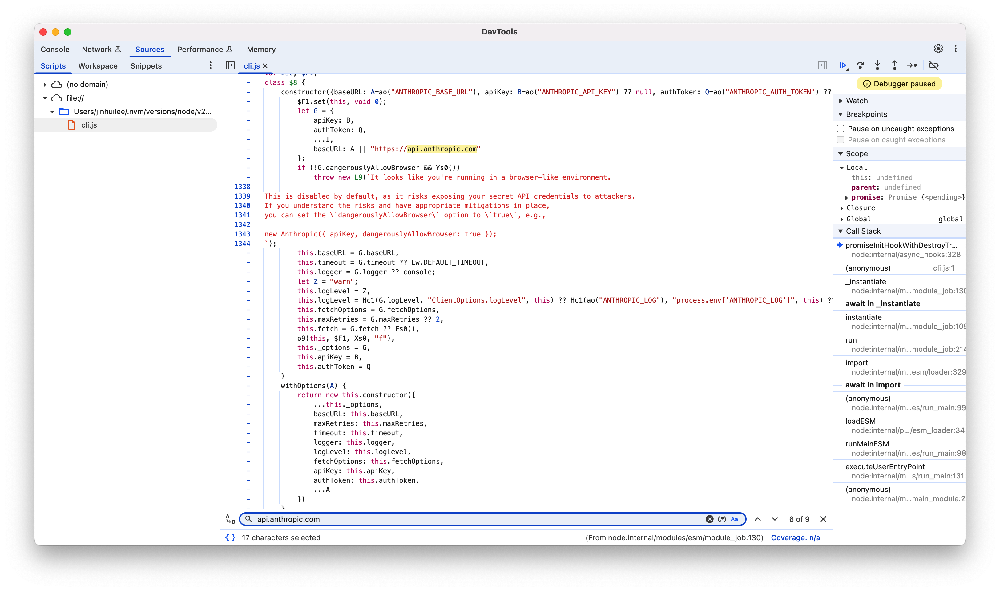

# Project Motivation and Principles

As early as the day after Claude Code was released (2025-02-25), I began and completed a reverse engineering attempt of the project. At that time, using Claude Code required registering for an Anthropic account, applying for a waitlist, and waiting for approval. However, due to well-known reasons, Anthropic blocks users from mainland China, making it impossible for me to use the service through normal means. Based on known information, I discovered the following:

1. Claude Code is installed via npm, so it's very likely developed with Node.js.
2. Node.js offers various debugging methods: simple `console.log` usage, launching with `--inspect` to hook into Chrome DevTools, or even debugging obfuscated code using `d8`.

My goal was to use Claude Code without an Anthropic account. I didn’t need the full source code—just a way to intercept and reroute requests made by Claude Code to Anthropic’s models to my own custom endpoint. So I started the reverse engineering process:

1. First, install Claude Code:
```bash
npm install -g @anthropic-ai/claude-code
```

2. After installation, the project is located at `~/.nvm/versions/node/v20.10.0/lib/node_modules/@anthropic-ai/claude-code`(this may vary depending on your Node version manager and version).

3. Open the package.json to analyze the entry point:
```package.json
{
  "name": "@anthropic-ai/claude-code",
  "version": "1.0.24",
  "main": "sdk.mjs",
  "types": "sdk.d.ts",
  "bin": {
    "claude": "cli.js"
  },
  "engines": {
    "node": ">=18.0.0"
  },
  "type": "module",
  "author": "Boris Cherny <boris@anthropic.com>",
  "license": "SEE LICENSE IN README.md",
  "description": "Use Claude, Anthropic's AI assistant, right from your terminal. Claude can understand your codebase, edit files, run terminal commands, and handle entire workflows for you.",
  "homepage": "https://github.com/anthropics/claude-code",
  "bugs": {
    "url": "https://github.com/anthropics/claude-code/issues"
  },
  "scripts": {
    "prepare": "node -e \"if (!process.env.AUTHORIZED) { console.error('ERROR: Direct publishing is not allowed.\\nPlease use the publish-external.sh script to publish this package.'); process.exit(1); }\"",
    "preinstall": "node scripts/preinstall.js"
  },
  "dependencies": {},
  "optionalDependencies": {
    "@img/sharp-darwin-arm64": "^0.33.5",
    "@img/sharp-darwin-x64": "^0.33.5",
    "@img/sharp-linux-arm": "^0.33.5",
    "@img/sharp-linux-arm64": "^0.33.5",
    "@img/sharp-linux-x64": "^0.33.5",
    "@img/sharp-win32-x64": "^0.33.5"
  }
}
```

The key entry is `"claude": "cli.js"`. Opening cli.js, you'll see the code is minified and obfuscated. But using WebStorm’s `Format File` feature, you can reformat it for better readability:


Now you can begin understanding Claude Code’s internal logic and prompt structure by reading the code. To dig deeper, you can insert console.log statements or launch in debug mode with Chrome DevTools using:

```bash
NODE_OPTIONS="--inspect-brk=9229" claude
```

This command starts Claude Code in debug mode and opens port 9229. Visit chrome://inspect/ in Chrome and click inspect to begin debugging:


By searching for the keyword api.anthropic.com, you can easily locate where Claude Code makes its API calls. From the surrounding code, it's clear that baseURL can be overridden with the `ANTHROPIC_BASE_URL` environment variable, and `apiKey` and `authToken` can be configured similarly:


So far, we’ve discovered some key information:

1. Environment variables can override Claude Code's `baseURL` and `apiKey`.

2. Claude Code adheres to the Anthropic API specification.

Therefore, we need:
1. A service to convert OpenAI API–compatible requests into Anthropic API format.

2. Set the environment variables before launching Claude Code to redirect requests to this service.

Thus, `claude-code-router` was born. This project uses `Express.js` to implement the `/v1/messages` endpoint. It leverages middlewares to transform request/response formats and supports request rewriting (useful for prompt tuning per model).

Back in February, the full DeepSeek model series had poor support for Function Calling, so I initially used `qwen-max`. It worked well—but without KV cache support, it consumed a large number of tokens and couldn’t provide the native `Claude Code` experience.

So I experimented with a Router-based mode using a lightweight model to dispatch tasks. The architecture included four roles: `router`, `tool`, `think`, and `coder`. Each request passed through a free lightweight model that would decide whether the task involved reasoning, coding, or tool usage. Reasoning and coding tasks looped until a tool was invoked to apply changes. However, the lightweight model lacked the capability to route tasks accurately, and architectural issues prevented it from effectively driving Claude Code.

Everything changed at the end of May when the official Claude Code was launched, and `DeepSeek-R1` model (released 2025-05-28) added Function Call support. I redesigned the system. With the help of AI pair programming, I fixed earlier request/response transformation issues—especially the handling of models that return JSON instead of Function Call outputs.

This time, I used the `DeepSeek-V3`  model. It performed better than expected: supporting most tool calls, handling task decomposition and stepwise planning, and—most importantly—costing less than one-tenth the price of Claude 3.5 Sonnet.

The official Claude Code organizes agents differently from the beta version, so I restructured my Router mode to include four roles: the default model, `background`, `think`, and `longContext`.

- The default model handles general tasks and acts as a fallback.

- The `background` model manages lightweight background tasks. According to Anthropic, Claude Haiku 3.5 is often used here, so I routed this to a local `ollama` service.

- The `think` model is responsible for reasoning and planning mode tasks. I use `DeepSeek-R1` here, though it doesn’t support cost control, so `Think` and `UltraThink` behave identically.

- The `longContext` model handles long-context scenarios. The router uses `tiktoken` to calculate token lengths in real time, and if the context exceeds 32K, it switches to this model to compensate for DeepSeek's long-context limitations.

This describes the evolution and reasoning behind the project. By cleverly overriding environment variables, we can forward and modify requests without altering Claude Code’s source—allowing us to benefit from official updates while using our own models and custom prompts.

This project offers a practical approach to running Claude Code under Anthropic’s regional restrictions, balancing `cost`, `performance`, and `customizability`. That said, the official `Max Plan` still offers the best experience if available.